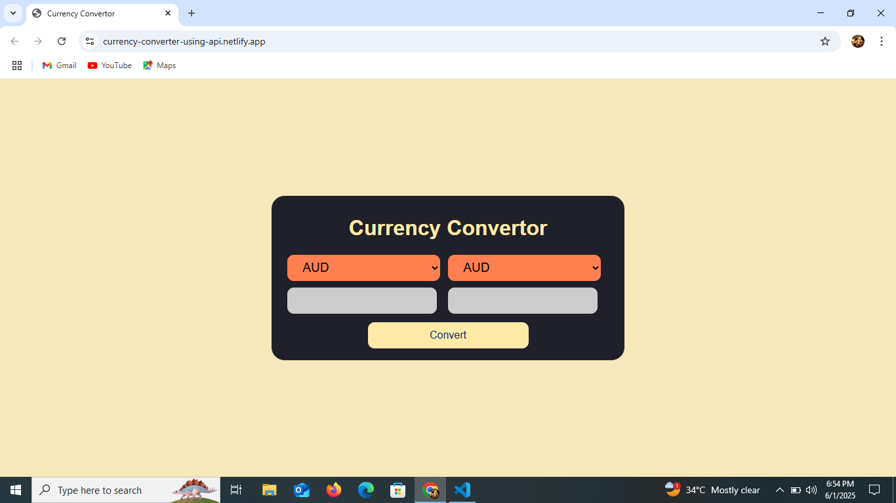
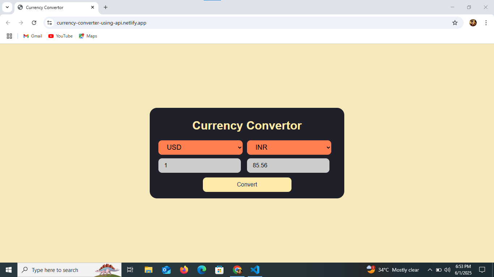

# Currency Converter

A simple web-based currency converter built using **HTML**, **CSS**, and **JavaScript**, with real-time exchange rates powered by the [Frankfurter API](https://www.frankfurter.app/).

## Demo

🔗 [Live Demo](https://currency-converter-using-api.netlify.app/)

## Screenshot

##  Developed By
**Gayathri G**  
GitHub: [GAYATHRI1006](https://github.com/GAYATHRI1006)

## Features

- Real-time currency conversion
- Fetches live exchange rates using Frankfurter API
- User-friendly interface with responsive design
- Supports 30+ global currencies
- Minimal and elegant design
